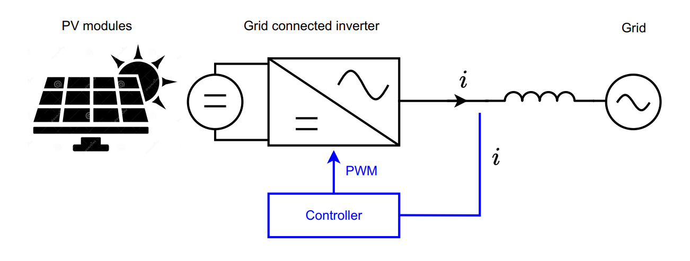

# UAS - Power Electronics

**Created by:**  
**Name:** Naufal Afrizal  
**NIM:** 22/500009/TK/54787  

---

## 📘 Overview

This repository contains the final project (UAS) for the Power Electronics course. The project is divided into two main tasks:

- **Task 1:** Design and control of a Buck Converter.
- **Task 2:** Design and control of a PV Grid-Connected Inverter System.

Each task involves theoretical design, component calculation, simulation, control strategy, and performance analysis.

---

## ⚡ Task 1: Buck Converter Design

### ✦ Specifications to Define:
- Input Voltage  
- Desired Output Voltage  
- Switching Frequency  
- Output Power  
- Permissible Inductor Current Ripple  
- Permissible Output Voltage Ripple  

### ✦ Design Steps:
1. Calculate suitable values for the inductor (L) and capacitor (C).
2. Simulate open-loop operation (no feedback control).
3. Design a cascaded control system for voltage regulation.
   - Include a complete block diagram.
   - Provide tuning methods or calculation of controller gains (e.g., Kp and Ki).
4. Plot:
   - Inductor current waveform (check current ripple criteria).
   - Output voltage waveform (check voltage ripple criteria).
5. Simulate:
   - Sudden load change: Analyze dynamic response and control stability.
   - Step change in reference voltage: Evaluate tracking performance.

---

## ☀️ Task 2: PV Grid-Connected Inverter System
  
*Figure 1: PV grid connected inverter*

### ✦ Design and Analysis Requirements:
1. Define PV array configuration:
   - Specify PV module voltage, current.
   - Arrangement (series/parallel).
2. Specify PV module ratings:
   - Voltage and current values.
3. Determine inverter specifications:
   - DC-link voltage  
   - AC output voltage  
   - Power rating  
   - Type of semiconductor switches  
   - Modulation strategy (with justification)
4. Calculate inverter-grid inductor (L):
   - Use phasor (vector) diagram to illustrate voltage-current relationships.

### ✦ Control System Design:
- Design controller for regulating both active and reactive power.
- Include block diagrams and controller gain design method.

### ✦ Simulations:
1. Inverter currents in dq-frame:
   - Compare reference vs measured currents.
   - Show three cases:
     - In-phase (unity power factor)
     - Lagging current
     - Leading current
2. Output voltage of inverter:
   - Plot in time and frequency domain.
   - Perform FFT to analyze harmonic distortion.
3. Overmodulation analysis:
   - Show waveform distortion and control performance degradation.
   - Support with simulation results.

---

## 📁 Repository Structure

